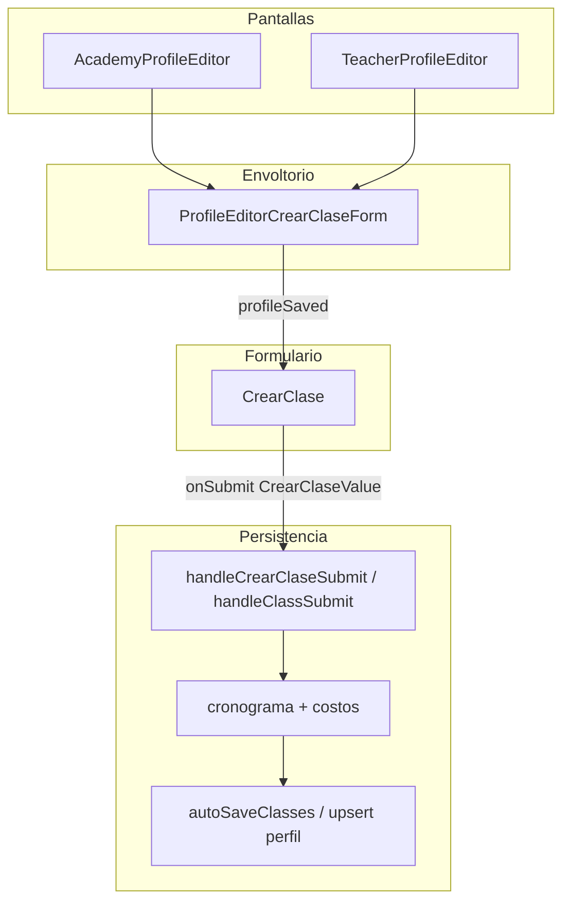

# Flujo del formulario de creación de clase

Documentación del flujo UX y de datos del formulario para **crear o editar una clase** en el perfil de **academia** o **maestro** (web).

## Resumen

- El UI principal es el componente **`CrearClase`** (`apps/web/src/components/events/CrearClase.tsx`).
- En editores de perfil se envuelve con **`ProfileEditorCrearClaseForm`**, que añade avisos (perfil sin guardar, mensajes de estado) y solo monta `CrearClase` cuando el perfil ya está persistido.
- Al guardar, el padre (**`AcademyProfileEditor`** / **`TeacherProfileEditor`**) convierte el payload en entradas de **`cronograma`** + **`costos`** y persiste vía el flujo de guardado de clases del perfil.

## Archivos relevantes

| Rol | Ruta |
|-----|------|
| Formulario principal | `apps/web/src/components/events/CrearClase.tsx` |
| Estilos | `apps/web/src/styles/crearClase.css` |
| Wrapper perfil | `apps/web/src/components/profile/ProfileEditorCrearClaseForm.tsx` |
| Integración academia | `apps/web/src/screens/profile/AcademyProfileEditor.tsx` (`handleCrearClaseSubmit`, `ProfileEditorCrearClaseForm`) |
| Integración maestro | `apps/web/src/screens/profile/TeacherProfileEditor.tsx` (`handleClassSubmit`, `ProfileEditorCrearClaseForm`) |

## Entrada: `ProfileEditorCrearClaseForm`

1. Muestra **`statusMsg`** (éxito / error) si existe.
2. Si **`profileSaved === false`**: muestra aviso para guardar el perfil primero; **no** renderiza `CrearClase`.
3. Si **`profileSaved === true`**: renderiza **`CrearClase`** pasando:
   - `ritmos`, `zonas`, `zonaTags`, `selectedZonaIds`, `locations`
   - `editingIndex`, `editInitial` (modo edición)
   - `onCancel`, `onSubmit`

## Componente `CrearClase`

### Props destacadas

- **`enableDate`** (default `true`): si es `false`, se omiten campos de fecha/horario del formulario (payload sin `fecha` / `fechaModo` / `diaSemana` en submit).
- **`editIndex` / `editValue`**: cuando hay edición, `editValue` sincroniza el estado interno vía `useEffect` (comparación profunda para evitar bucles).
- **`onChange`**: se dispara al actualizar campos (incluye derivado `nivel` como string desde chips de niveles).
- **`onSubmit`**: recibe un **`CrearClaseValue`** ya normalizado (p. ej. `precio` según tipo, `nivel` desde niveles).

### Secciones del formulario (orden visual)

1. **Información básica** (`cc__card` + icono Tag)  
   - Nombre (obligatorio para enviar).  
   - Descripción.  
   - Tipo (`clases sueltas`, `paquetes`, `coreografia`, `entrenamiento`, `otro`, `personalizado`).  
   - Niveles (chips: catálogo fijo).  
   - **Costo (MXN)**: solo editable si el tipo es **`clases sueltas`**; en otro caso el input va deshabilitado y el precio se fuerza a `null` al guardar.

2. **Ritmos** (icono Music)  
   - `RitmosChips` ligado a catálogo + tags del perfil; actualiza `ritmoIds` / `ritmoId`.

3. **Horario** (icono Calendar) — solo si **`enableDate`**  
   - Modalidad de fecha: **fecha específica** o **semanal** (la opción “por agendar” está comentada/oculta en UI; datos legacy se normalizan).  
   - Fecha concreta o días de la semana.  
   - Horario: en el flujo actual predominan **inicio / fin** (`horarioModo` específica); bloque “duración” aparece en ramas `por_agendar` o `horarioModo === 'duracion'`.

4. **Ubicación** (icono MapPin)  
   - Selector de **sede guardada** (`locations`) o captura manual (nombre, dirección, notas).  
   - Zonas: solo lectura / chips según sede o zonas del perfil (expandible).

5. **Pie**  
   - Cancelar → `onCancel` + reset del formulario interno.  
   - Guardar → valida **`canSubmit`**, construye payload y llama **`onSubmit`**.

### Validación para habilitar “Guardar” (`canSubmit`)

- **Nombre** no vacío (trim).
- **Fecha** (si `enableDate`):  
  - `especifica` → debe haber `fecha`.  
  - `semanal` → al menos un día en `diasSemana` o `diaSemana`.  
  - `por_agendar` → no exige fecha en lista (caso legacy).
- **Horario**:  
  - Si `por_agendar` o modo duración → `duracionHoras > 0`.  
  - Si horario específico (y no por agendar) → `inicio` y `fin`.

No exige ritmos, ubicación ni costo para enviar.

---

## Campos del modelo `CrearClaseValue` y lógica

Tipo exportado en `CrearClase.tsx`. Cada fila indica si hay **control visible** en el formulario, para qué sirve y reglas importantes.

### Información básica y costo

| Campo | ¿En el formulario? | Uso y lógica |
|-------|-------------------|--------------|
| **`nombre`** | Sí (texto obligatorio para guardar) | Título de la clase; `trim` usado en validación. |
| **`descripcion`** | Sí (textarea) | Texto libre; opcional para enviar. |
| **`tipo`** | Sí (`<select>`) | Valores: `clases sueltas`, `paquetes`, `coreografia`, `entrenamiento`, `otro`, `personalizado`. Default interno `clases sueltas`. |
| **`precio`** | Sí (número MXN), **solo habilitado si `tipo === 'clases sueltas'`** | Si el tipo cambia a otro valor, **`precio` se fuerza a `null`**. Al enviar se aplica **`normalizePrecioForTipo`**: fuera de `clases sueltas` siempre `null`. El input no procesa cambios si el tipo no es clases sueltas. |
| **`niveles`** | Sí (chips) | Array de etiquetas del catálogo fijo (p. ej. Principiante, Intermedio). Mutuamente excluyente con “Todos los niveles” según lógica de chips. |
| **`nivel`** | No como campo directo | **Derivado al enviar**: `nivelesToNivelString(niveles)` → un solo string con niveles unidos por ` · `, o `null`. Es lo que suele persistir el backend junto al cronograma. En `onChange` al padre se envía también `nivel` derivado para mantener consistencia. |
| **`regla`** | No hay input en el UI actual | Se mantiene en estado (inicial/sync/reset) para datos legados; suele ir vacío. El padre puede seguir guardándolo en el objeto **costo** si viene en flujos antiguos. |

### Ritmos

| Campo | ¿En el formulario? | Uso y lógica |
|-------|-------------------|--------------|
| **`ritmoIds`** | Sí (vía `RitmosChips`) | Lista de IDs de tags de tipo ritmo del perfil. Se rellenan mapeando slugs del catálogo a IDs de `ritmos` (prop). |
| **`ritmoId`** | Derivado | Se iguala al **primer** elemento de `ritmoIds` si hay alguno; si no, `null`. Mantiene compatibilidad con un solo ritmo. |

### Fecha y horario (solo si `enableDate === true`)

Si **`enableDate`** es `false`, en **`handleSubmit`** se **eliminan** del payload `fecha`, `fechaModo` y `diaSemana` (el resto del estado puede seguir existiendo en memoria según props).

| Campo | ¿En el formulario? | Uso y lógica |
|-------|-------------------|--------------|
| **`fechaModo`** | Sí (botones: específica / semanal) | `especifica`: una fecha concreta. `semanal`: uno o más días. La opción **por agendar** no está en la UI actual; si llega datos legacy (`por_agendar`), un `useEffect` puede normalizar a `semanal` y ajustar `horarioModo`. |
| **`fecha`** | Sí (`type="date"`) si `fechaModo === 'especifica'` | Obligatoria para `canSubmit` en ese modo. |
| **`diasSemana`** | Sí (botones L–D) si `fechaModo === 'semanal'` | Array de enteros 0–6 (domingo–sábado). Al menos un día requerido para enviar en modo semanal. |
| **`diaSemana`** | Derivado / sincronizado | Al seleccionar días, se actualiza para reflejar el primero del array (compatibilidad). |
| **`horarioModo`** | Parcialmente oculto | `especifica` → campos `inicio` y `fin`. `duracion` → `duracionHoras`. La UI de “modo horario” puede estar comentada; la rama visible depende de `por_agendar` y del valor efectivo tras normalización legacy. |
| **`inicio`**, **`fin`** | Sí (`type="time"`) cuando aplica horario específico y no es flujo “por agendar” | Formato normalizado con **`normalizeTime`** (HH:mm). Obligatorios si esa rama exige horario específico. |
| **`duracionHoras`** | Sí cuando la lógica cae en duración (p. ej. `por_agendar` o `horarioModo === 'duracion'`) | Número (p. ej. 1.5 horas); obligatorio en esa rama para `canSubmit`. |

**Resumen lógico `canSubmit` (fecha/hora):**

- Sin `enableDate`: no valida fechas ni horas.
- Con `enableDate`: según `fechaModo` exige fecha **o** días; según modalidad de horario exige **inicio+fin** **o** **duracionHoras** según las ramas anteriores.

### Ubicación y zona

| Campo | ¿En el formulario? | Uso y lógica |
|-------|-------------------|--------------|
| **`ubicacionId`** | Sí (select de sedes si hay `locations`) | Id de la sede elegida; vacío = entrada manual. |
| **`ubicacionNombre`**, **`ubicacionDireccion`**, **`ubicacionNotas`** | Sí | Rellenan al elegir sede o manualmente. El padre suele concatenar nombre/dirección/notas en un string de **ubicación** para el cronograma. |
| **`ubicacion`** | No siempre en UI | A veces legado; el flujo actual prioriza nombre/dirección/notas. |
| **`zonaId`** | No hay selector directo | Estado reservado/sync; las **zonas** se muestran como chips de solo lectura (`ZonaGroupedChips` en modo display) según zonas de la sede o del perfil (`selectedZonaIds`). |

### Lógica al enviar (`handleSubmit` interno)

1. Construye **`submissionBase`**: si `!enableDate`, quita `fecha`, `fechaModo`, `diaSemana` del objeto que sale del estado.
2. **`submission`** final:
   - **`precio`**: `normalizePrecioForTipo(tipo, precio)`.
   - **`nivel`**: `nivelesToNivelString(niveles)` (string único o `null`).
3. Llama **`onSubmit(submission)`** y luego **reset** del formulario y estado de éxito/error del botón.

### Reglas de **precio** y **tipo** (refuerzo)

- Función **`normalizePrecioForTipo(tipo, precio)`**: solo devuelve número si `tipo === 'clases sueltas'`; si no, **`null`**.
- Al cambiar el tipo en el `<select>`, si deja de ser `clases sueltas`, **`precio`** se pone en **`null`**.
- El objeto enviado al padre siempre lleva **`precio`** ya normalizado.

## Flujo de datos al guardar (perfil academia / maestro)

1. **`CrearClase`** ejecuta **`handleSubmit`**: opcionalmente elimina campos de fecha si `enableDate` es false; añade `nivel` como string desde chips; normaliza **`precio`**.
2. El padre recibe el objeto en:
   - **Academia**: `handleCrearClaseSubmit` en `AcademyProfileEditor.tsx`
   - **Maestro**: `handleClassSubmit` en `TeacherProfileEditor.tsx`
3. Lógica típica:
   - **Edición** (`editingIndex` válido): actualiza el ítem del **cronograma** y el registro de **costo** asociado (por `classId`, `referenciaCosto` o índice).
   - **Alta nueva**: genera id de clase, añade fila al cronograma y un **`newCosto`** / **`updatedCosto`** con `precio` solo si `tipo === 'clases sueltas'`.
4. Persistencia: **`setField`** de `cronograma` y `costos` + **`autoSaveClasses`** (academia) o **`upsert`** (maestro), según implementación actual.

## Modo edición

- **`editingIndex`** + **`editInitial`** (academia) o **`handleClassEdit`** (maestro) rellenan el formulario con datos del cronograma + costo vinculado.
- Al rellenar **`precio`** desde costo guardado, solo se muestra valor numérico si el tipo del costo es **`clases sueltas`**.

## Notas de implementación

- Sincronización **`value` / `editValue`**: refs previenen bucles infinitos al comparar campos antes de `setForm`.
- **`isDirty`**: compara un objeto “comparable” normalizado (incluye `precio` normalizado por tipo) frente al inicial.
- Estados del botón guardar: idle / saving / success / error (mensajes en etiqueta del botón).

---

*Última revisión alineada con el código en `CrearClase.tsx` y los editores de perfil mencionados.*
