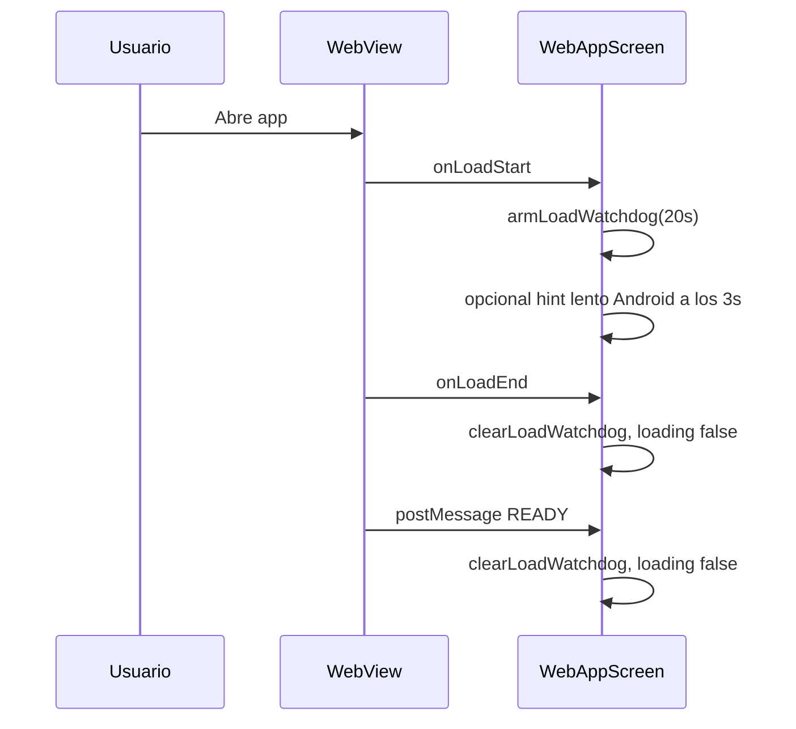

# Android: auditoría de timeout, reintentos y fases de carga (WebView)

Fecha de referencia de código: 2026-04-08.  
Relacionado: [ANDROID_CONNECTION_AND_LOAD_AUDIT.md](./ANDROID_CONNECTION_AND_LOAD_AUDIT.md) (matriz de escenarios y protocolo ADB).

## Objetivo

Documentar dónde y cuándo aparece el estado de error / “Reintentar”, qué timeouts aplican y qué hipótesis explican un fallo “demasiado pronto” en Android.

## Archivos implicados

| Archivo | Rol |
|--------|-----|
| [`src/screens/WebAppScreen.tsx`](../../src/screens/WebAppScreen.tsx) | WebView, watchdog de carga, `onError` / `onHttpError`, overlay de error, auto-retry, healthcheck ligero (solo Android), fases de carga / hints. |
| [`src/lib/networkDiagnostics.ts`](../../src/lib/networkDiagnostics.ts) | NetInfo, `runLightweightHealthcheck` (timeout por defecto 3500 ms; valor Android puede sobrescribirse en el caller). |

## Constantes (valores actuales tras ajuste)

| Constante | Valor | Dónde | Efecto |
|-----------|-------|-------|--------|
| `LOAD_TIMEOUT_MS` | 20_000 ms | `WebAppScreen` | Si no hay `onLoadEnd` ni mensaje `READY` que limpie el watchdog, se dispara `load_timeout` y overlay de error. |
| Watchdog | Mismo valor | `armLoadWatchdog` | Se programa en cada `onLoadStart`; se limpia en `onLoadEnd`, `READY`, errores confirmados, y rutas que cancelan navegación. |
| Healthcheck ligero (`timeoutMs`) | 5_750 ms en Android (caller) | `triggerLightHealthcheck` | Solo diagnóstico (fetch a origen web + Supabase); **no** activa `hasError`. |
| Cooldown healthcheck | 5_000 ms mínimo entre ejecuciones | `triggerLightHealthcheck` | Evita ráfagas. |
| Auto-retry tras error transitorio | 1_200 ms delay | `useEffect` en `hasError` | Un reintento automático si `isLikelyTransientError` y red OK. |
| Hint “carga lenta” (Android) | 3_000 ms desde `onLoadStart` | `WebAppScreen` | Banner suave; no es pantalla de error. |
| Debounce `onError` (Android) | 600 ms | `WebAppScreen` | Evita overlay inmediato por errores efímeros del WebView (no aplica a SSL ni a crash de renderer). |
| Confirmación “sin internet” (Android) | 1_500 ms con NetInfo en `false` | `offlineSinceAt` + `buildErrorUiModel` | Evita titular “Sin conexión” por un flicker de NetInfo. |

## Diagrama de secuencia (carga nominal)

## Condiciones que llaman a `setHasError(true)`

1. **Watchdog** (`load_timeout`): no `onLoadEnd` dentro de 20 s (y no se limpió antes por `READY` / error).
2. **`onError`**: error nativo del WebView; en Android puede ir con **debounce** salvo SSL / crash de proceso.
3. **`onHttpError`**: `statusCode >= 400`; se **ignora** si parece recurso/subrecurso ajeno al documento principal del dominio (evita 404 de asset).
4. **`onRenderProcessGone` / `onContentProcessDidTerminate`**: inmediato.
5. **Fallo al importar** `react-native-webview**: inmediato.

## Hipótesis: por qué el retry parece “muy rápido”

1. **`onError` temprano**: redirects, DNS intermedio o errores transitorios en Android suelen disparar `onError` antes de que la SPA termine; el debounce y la clasificación de subrecursos reducen falsos positivos.
2. **No es el watchdog de 20 s**: en muchos informes el problema no es `load_timeout` sino el punto 1.
3. **NetInfo**: valores `false` breves; la confirmación con duración mínima evita el copy fuerte de “Sin conexión” de inmediato.
4. **Healthcheck**: nunca muestra error por sí solo; timeout mayor solo mejora el diagnóstico en red lenta.

## Web (Explore) — `notifyError`

En `ExploreHomeScreenModern` existe timeout de datos (20 s) y `notifyError`; el host **no** muestra overlay nativo por `type: "ERROR"` hasta que exista handler explícito. No cuenta como “Reintentar conexión” nativo.

## Validación manual (matriz)

| Escenario | Qué comprobar |
|-----------|----------------|
| Buena conexión | No overlay de error en los primeros segundos sin `onError` real. |
| Red lenta | Hint “Cargando… puede tardar” (Android) antes de error por timeout largo. |
| Sin red estable | Mensaje “Sin conexión” tras confirmación, no al primer flicker. |
| Foreground | Misma lógica; revisar que `onLoadStart` reinicie timers y debounce. |

Usar `adb logcat` con filtro `WEBVIEW_DIAG` / `WEBVIEW_ERR` según [ANDROID_CONNECTION_AND_LOAD_AUDIT.md](./ANDROID_CONNECTION_AND_LOAD_AUDIT.md).

## Validación (esta iteración)

- **Código / tipos:** `WebAppScreen` y `networkDiagnostics` sin errores de linter en el archivo tocado; `tsc` del repo puede fallar por otros archivos preexistentes.
- **Dispositivo:** ejecutar la matriz de la tabla anterior en **Android real** (y un smoke en iOS: abrir app, navegar, sin overlay de error inesperado). Eventos `load_phase` y `error_deferred` solo en `__DEV__` o con `showConfigDebug`; `error_confirmed` y healthcheck siguen en logcat Android en producción.

